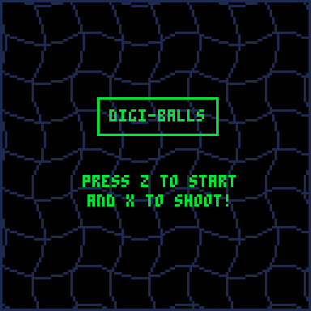
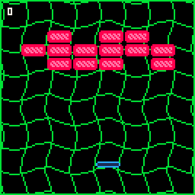

# Digiballs

  

Digi-Balls is a simple clone of Breakout made from scratch in the **PICO-8** game engine.

## Overview

Digi-balls is a fully functioning breakout inspired game developed to learn game loop logic, physics, and light visual/audio design. Think of it as a "hello world" project focused on seeing what I could do within the constraints of the PICO-8 fantasy console.

### Features

- Custom collision detection between the ball, padle, and borders.
- Consistent retro polish through custom animations and sprite work.
- Randomized brick placement system. No one level will be the same!
- Level progression and score tracking for each play session.

#### What I Learned

This was my first project getting deep into the fundamentals of the various aspects of programming. Some of my key takeaways included:
 - State Logic: Designing different states that allowed for different restrictions and design choices to be implemented without having to write out overly-complex logic.
 - Function Importance: As I was desinging the logic for the sine waves in the background, using a function was essential in helping me reduce redundancy in my code. I began to realize the power of this late into development, and have no doubt that I could refine this code further, however, I have other things I'd like to get to.
 - Memory Management: Tried to focus on memory limitations by creating a table for how the bricks would be distributed in their respective rows and columns. Implementing this allowed there to be a unique level experience each play session.
 - Physics Implementation: Learned how to implement basic relationships of physics from the ground up.

